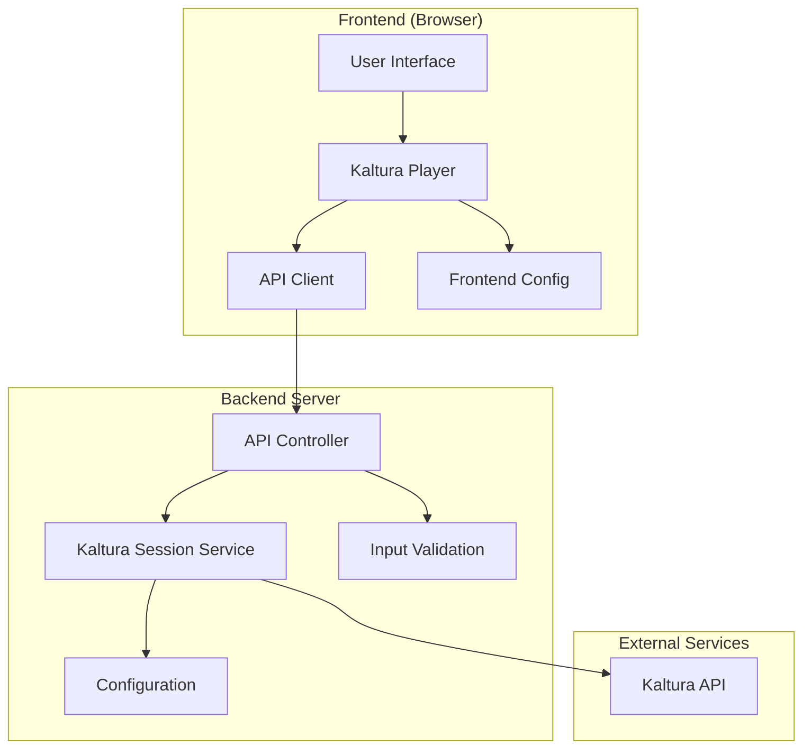
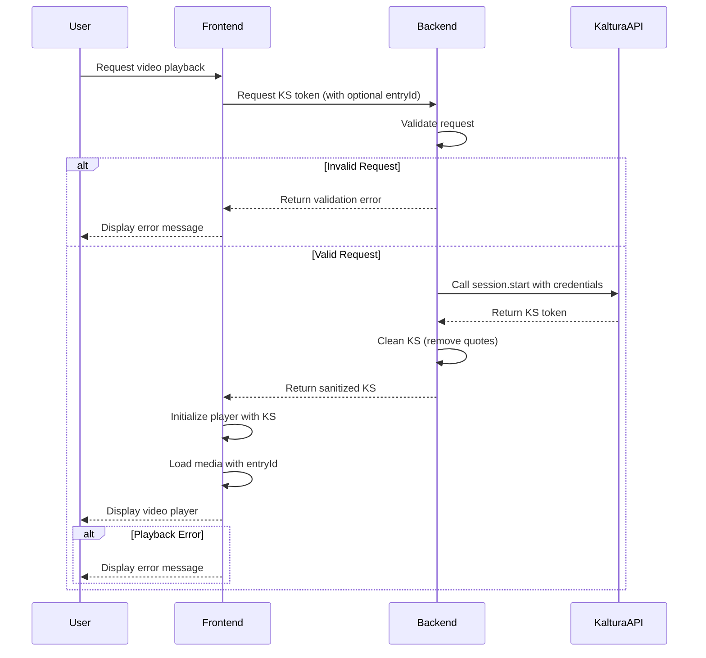

# Kaltura Video Embedding Application Architecture

## Overview

This document outlines the architecture for a lean, secure Kaltura video embedding application built with TypeScript, React, and Vite.js. The application consists of a minimal backend service for secure Kaltura Session (KS) generation and a responsive frontend for video playback.

## System Architecture

The application follows a client-server architecture with clear separation of concerns:

1. **Backend Service**: A secure Node.js/Express server that handles KS generation and exposes a minimal API
2. **Frontend Application**: A Vite.js/TypeScript SPA that consumes the backend API and renders the Kaltura player

### Component Diagram



### Data Flow Diagram



## Security Considerations

1. **API Secret Protection**: All Kaltura API secrets are stored server-side only
2. **Environment Variables**: Sensitive configuration is managed via environment variables
3. **CORS Protection**: Proper CORS configuration to restrict API access
4. **Input Validation**: Validate all inputs on the backend using Joi schema validation
5. **HTTPS**: All communication should be over HTTPS
6. **Short-lived Tokens**: KS tokens have configurable expiration times (default 24 hours)
7. **Minimal Privileges**: KS tokens include only required privileges based on configuration
8. **Content Security Policy**: Implemented via Helmet middleware on the backend
9. **Error Handling**: Proper error handling to prevent information leakage

## File Structure

```
kaltura-video-app/
├── .gitignore                  # Git ignore file
├── README.md                   # Project documentation
├── LICENSE                     # License file
├── architecture.md             # This architecture document
├── create-env.sh               # Script to create environment files
├── create-frontend-env.sh      # Script to create frontend environment files
├── start-dev.sh                # Script to start development servers
│
├── backend/                    # Backend service
│   ├── .env.example.json       # Example environment variables (no secrets)
│   ├── package.json            # Backend dependencies and scripts
│   ├── package-lock.json       # Backend dependency lock file
│   ├── tsconfig.json           # Backend TypeScript config
│   └── src/
│       ├── index.ts            # Entry point
│       ├── config.ts           # Configuration management
│       ├── test.ts             # Test file
│       ├── routes/
│       │   └── ks.routes.ts    # KS API routes
│       ├── controllers/
│       │   └── ks.controller.ts # KS controller
│       ├── services/
│       │   └── kaltura.service.ts # Kaltura API integration
│       └── utils/
│           └── validation.ts   # Input validation utilities
│
└── frontend/                   # Frontend application
    ├── index.html              # HTML entry point
    ├── package.json            # Frontend dependencies and scripts
    ├── package-lock.json       # Frontend dependency lock file
    ├── tsconfig.json           # Frontend TypeScript config
    ├── tsconfig.node.json      # Frontend Node TypeScript config
    ├── vite.config.ts          # Vite configuration
    ├── public/                 # Static assets
    └── src/
        ├── main.tsx            # Application entry point
        ├── App.tsx             # Root component
        ├── App.css             # Root component styles
        ├── index.css           # Global styles
        ├── components/
        │   ├── VideoPlayer.tsx # Kaltura player component
        │   └── VideoPlayer.css # Kaltura player component styles
        ├── services/
        │   └── api.ts          # API client
        ├── types/
        │   └── index.ts        # TypeScript type definitions
        └── utils/
            └── config.ts       # Frontend configuration
```

## API Design

### Backend API Endpoints

#### `POST /api/ks`
Generates a Kaltura Session token with required privileges.

**Request:**
```json
{
  "entryId": "your_entry_id"  // Optional - can be configured server-side
}
```

**Response:**
```json
{
  "ks": "djJ8MjM2MTk1MnxhYmNkZWZnaGlqa2xtbm9wcXJzdHV2d3h5eg=="
}
```

**Error Responses:**

1. Validation Error:
```json
{
  "status": 400,
  "error": "Validation Error",
  "details": [
    {
      "field": "entryId",
      "message": "\"entryId\" must be a valid entry ID format"
    }
  ]
}
```

2. Server Error:
```json
{
  "error": "Failed to generate KS token",
  "status": 500
}
```

#### `GET /health`
Health check endpoint to verify the server is running.

**Response:**
```json
{
  "status": "ok"
}
```

### Kaltura API Integration

The backend uses the Kaltura session.start API to generate KS tokens with the following privileges:
- setrole:PLAYBACK_BASE_ROLE
- sview:{entryId}
- eventsessioncontextid:{entryId}
- privacycontext:{privacyContext}
- enableentitlement
- appid:{appId}
- virtualeventid:{virtualEventId}
- restrictexplicitliveview:*

All values in curly braces are loaded from environment variables. The backend supports both default entry ID from configuration and custom entry ID provided in the request.

The KalturaService class handles:
1. Building the privileges string based on configuration and request parameters
2. Making the API request to Kaltura
3. Processing and cleaning the response
4. Error handling and validation

## Configuration Management

### Backend Configuration
- Kaltura API endpoint (`KALTURA_API_ENDPOINT`)
- Kaltura partner ID (`KALTURA_PARTNER_ID`)
- Kaltura admin secret (`KALTURA_ADMIN_SECRET`)
- KS expiration time (`KALTURA_KS_EXPIRY_SECONDS`, default: 86400 seconds/24 hours)
- Default privileges (built from various environment variables)
- Default entry ID (`KALTURA_DEFAULT_ENTRY_ID`)
- Privacy context (`KALTURA_PRIVACY_CONTEXT`)
- App ID (`KALTURA_APP_ID`)
- Virtual event ID (`KALTURA_VIRTUAL_EVENT_ID`)
- Server port (`PORT`, default: 3000)
- CORS allowed origins (`CORS_ALLOWED_ORIGINS`, default: '*')

### Frontend Configuration
- Backend API base URL (`API_BASE_URL`, default: 'http://localhost:3000/api')
- Backend KS endpoint (`API_KS_ENDPOINT`, default: 'http://localhost:3000/api/ks')
- Kaltura partner ID (`KALTURA_PARTNER_ID`)
- Kaltura UI configuration ID (`KALTURA_UICONF_ID`)
- Default entry ID (`DEFAULT_ENTRY_ID`)
- UI configuration (container class, player class, aspect ratio)

## Non-Functional Requirements

1. **Performance**:
   - Minimize API calls to Kaltura
   - Optimize frontend bundle size
   - Lazy loading of the Kaltura Player script
   - Efficient player initialization and cleanup

2. **Scalability**:
   - Stateless backend design for horizontal scaling
   - Consider rate limiting for KS generation
   - Error handling for service unavailability

3. **Maintainability**:
   - Clear code organization with separation of concerns
   - Comprehensive documentation and comments
   - Type safety with TypeScript interfaces and type definitions
   - Modular component design

4. **Monitoring**:
   - Comprehensive logging for debugging
   - Error tracking and reporting
   - Health check endpoint for monitoring

## Assumptions and Trade-offs

1. **Assumptions**:
   - The application will be deployed in a secure environment
   - Kaltura API is available and responsive
   - The application will handle a moderate load
   - Users have valid Kaltura entry IDs for videos they want to play

2. **Trade-offs**:
   - Simplicity over complex features
   - Security over convenience
   - Type safety over development speed
   - Frontend flexibility over backend complexity

## Implementation Notes

1. **Backend Implementation**:
   - Express.js for the API server with middleware for security (Helmet) and CORS
   - Axios for HTTP requests to Kaltura API
   - Joi for request validation
   - Comprehensive error handling and logging
   - Environment variable management with dotenv

2. **Frontend Implementation**:
   - React with TypeScript for UI components
   - Official Kaltura Player JS library with dynamic loading
   - Responsive design with CSS
   - Error handling and loading states
   - TypeScript interfaces for type safety

3. **Development Workflow**:
   - Separate package.json for backend and frontend
   - Development scripts for concurrent development
   - Environment-specific configuration via shell scripts
   - Health check endpoint for monitoring